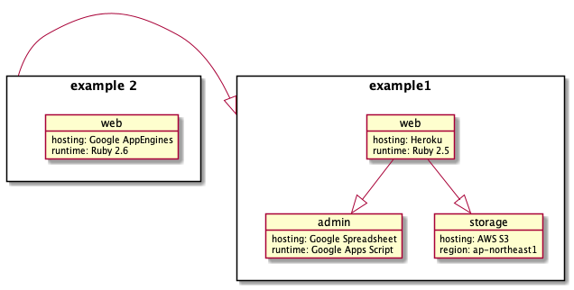

# SimpleHdGraph

parse single-tier hierarchy, simplex direction graph from YAML DSL, render PlantUML.

## Installation

Add this line to your application's Gemfile:

```ruby
gem 'simple-hd-graph'
```

And then execute:

    $ bundle

Or install it yourself as:

    $ gem install simple-hd-graph

## Usage

    $ simple-hd-graph -f FILE

or

    $ simple-hd-graph -d DIR

## Format

SimpleHdGraph was designed primarily to describe systems, its constituent resources, and their dependencies.

The two components are as follows:

 * Context
 * Resource

A single YAML document corresponds to a single context as below:

<pre>
<b>id</b>: name1
<b>resources</b>:
  resource1:
    note: memo
    <b>has</b>: resource2
  resource2:
    note: very important
<b>depends</b>:
 - name2
</pre>

features:

 * Context can contain mutiple Resources
 * Resource can use the `has` keyword to indicate that it owns other Resources
 * Context can use the `depends` keyword to indicate its dependency on other Contexts

## Example

input ( streams )

```yaml
id: example1
resources:
  web:
    hosting: Heroku
    runtime: Ruby 2.5
    has:
      - admin
      - storage
  admin:
    hosting: Google Spreadsheet
    runtime: Google Apps Script
  storage:
    hosting: AWS S3
    region: ap-north-east1
---
id: example 2
resources:
  web:
    hosting: Google AppEngines
    runtime: Ruby 2.6
depends:
  - example1
```

output

```plantuml
rectangle "example1" as example1 {
  object "web" as example1Web {
    hosting: Heroku
    runtime: Ruby 2.5
  }
  object "admin" as example1Admin {
    hosting: Google Spreadsheet
    runtime: Google Apps Script
  }
  object "storage" as example1Storage {
    hosting: AWS S3
    region: ap-north-east1
  }

  example1Web -d-|> example1Admin
  example1Web -d-|> example1Storage
}
rectangle "example 2" as example2 {
  object "web" as example2Web {
    hosting: Google AppEngines
    runtime: Ruby 2.6
  }
}
example2 -|> example1
```

after plantuml converted



## Development

After checking out the repo, run `bin/setup` to install dependencies. Then, run `rake test` to run the tests. You can also run `bin/console` for an interactive prompt that will allow you to experiment.

To install this gem onto your local machine, run `bundle exec rake install`. To release a new version, update the version number in `version.rb`, and then run `bundle exec rake release`, which will create a git tag for the version, push git commits and tags, and push the `.gem` file to [rubygems.org](https://rubygems.org).

## Contributing

Bug reports and pull requests are welcome on GitHub at https://github.com/wtnabe/simple-hd-graph.
